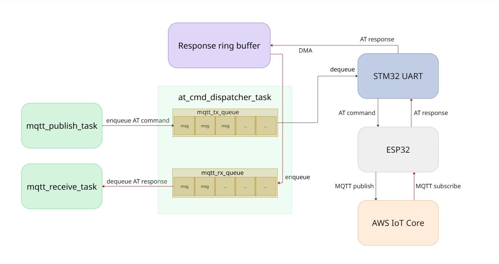
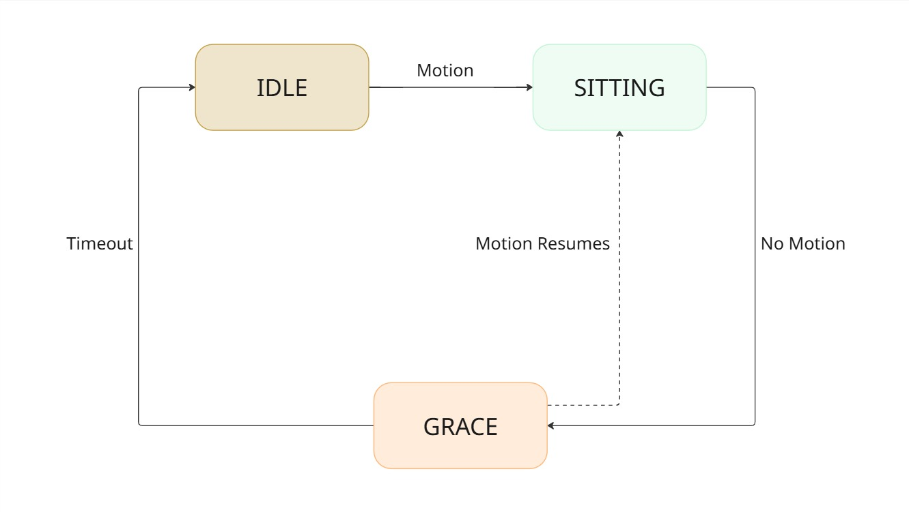

# IoT Desk Occupancy Tracker

An embedded IoT project running on the **STM32F407G-DISC1** discovery board. A PIR sensor detects whether someone is seated at a desk. The firmware tracks session duration and publishes updates to **AWS IoT Core** over MQTT/TLS, routed through an **ESP32** Wi-Fi module controlled entirely via AT commands over UART.

---

## What it does

When the PIR sensor detects motion, a sitting session starts. While the person stays seated, the device publishes a heartbeat every 5 minutes with the current duration. If motion stops, there's a 3-minute grace period before the session officially ends — a final publish goes out with the total sitting time.

```
{"sitting": true, "duration_mins": 0}          ← session start
{"sitting": true, "duration_mins": 5}           ← heartbeat at 5 min
{"session_end": true, "total_duration_mins": 8} ← session ended
```

All messages land on the topic defined in `application_config.h` (default: `sensors/room1/motion`).

---

## Hardware

| Component | Details |
|-----------|---------|
| MCU | STM32F407VGTx — ARM Cortex-M4, 168 MHz |
| Board | STM32F407G-DISC1 Discovery Kit |
| Wi-Fi / MQTT bridge | ESP32-WROOM-32 (AT command firmware) |
| PIR sensor | HC-SR501|

**STM32 Peripheral map:**

| Peripheral | Pins | Config | Purpose |
|-----------|------|--------|---------|
| UART4 | PA0 (TX), PA1 (RX) | 115200 8N1 | ESP32 AT commands |
| USART2 | PA2 (TX), PA3 (RX) | 115200 8N1 | Debug log output |
| GPIO PD1 | PD1 | EXTI, rising/falling, pull-down | PIR sensor input |
| DMA1 Stream2 | — | Circular, byte | UART4 RX buffer |
| TIM6 | — | — | HAL timebase |

**ESP32 wiring:**

| STM32 | Direction | ESP32 |
|-------|-----------|-------|
| PA0 (UART4 TX) | → | UART2 RX |
| PA1 (UART4 RX) | ← | UART2 TX |

The ESP32 acts purely as a modem here. The STM32 owns all the application logic.

**Power:** Both boards are powered via USB during development, the STM32 discovery board through its ST-LINK USB port, the ESP32 module through a separate USB connection to the same host machine.

---

## Architecture

Three FreeRTOS tasks, one queue-based UART dispatcher:




**Sitting session state machine:**



- `SESSION_IDLE` — waiting for PIR trigger
- `SESSION_SITTING` — active session, heartbeat every 5 minutes
- `SESSION_GRACE` — 3-minute window after motion is lost before ending the session

---

## Getting started

### 1. AWS IoT Core setup

- Create a **Thing** in the AWS Console
- Attach a policy that allows `iot:Connect`, `iot:Publish`, `iot:Subscribe`, `iot:Receive`
- Download: **CA certificate**, **device certificate**, **private key**
- Note your **device data endpoint** (IoT Core → Settings)

### 2. Flash the ESP32

The ESP32-WROOM-32 needs Espressif's AT command firmware installed. Before building, place your AWS IoT certificates (CA cert, client cert, private key) in the appropriate folders in the AT firmware project as they get baked into the flash image at build time. Follow the [Espressif AT compile guide](https://docs.espressif.com/projects/esp-at/en/latest/esp32/Compile_and_Develop/How_to_clone_project_and_compile_it.html) for the full process.

The certificates are stored in the ESP32's flash and persist across resets. They are never part of the STM32 firmware.

### 3. Configure the project

Copy the example config and fill in your values:

```
IOT_SDK/config/application_config_example.h  →  IOT_SDK/config/application_config.h
```

```c
#define WIFI_SSID       "your-network"
#define WIFI_PASSWORD   "your-password"
#define MQTT_BROKER     "xxxxxxxxxx.iot.ap-south-1.amazonaws.com"
#define CLIENT_ID       "your-thing-name"
#define UTC_OFFSET      X   // hours from UTC
```

**Do not commit `application_config.h`.**

### 4. Build and flash

This project uses the **STM32CubeIDE** toolchain (Eclipse CDT managed build, `arm-none-eabi-gcc`). There is no standalone Makefile and building outside of STM32CubeIDE would require manually reconstructing the include paths, compiler flags, and linker script configuration.

Open the project folder in STM32CubeIDE, build, and flash via onboard debugger.


### 5. Verify

On first boot, the device:
1. Initializes the ESP32 (reset, echo off, station mode)
2. Connects to Wi-Fi — retries indefinitely until successful
3. Syncs time via SNTP
4. Connects to the MQTT broker over TLS (port 8883, mutual auth)
5. Starts the FreeRTOS scheduler

Watch the debug output on USART2.

---

## Project structure

```
Core/Src/main.c                   — application entry, FreeRTOS tasks, PIR ISR
IOT_SDK/BSP/esp32_at.c            — AT command wrappers (connect, publish, subscribe, receive)
IOT_SDK/BSP/esp32_at_io.c         — DMA circular buffer RX, UART send/receive primitives
IOT_SDK/mqtt_helper/mqtt_helper.c — MQTT connect/publish/subscribe built on esp32_at.c
IOT_SDK/config/application_config.h — all credentials and constants (not committed)
```

Third-party code under `IOT_SDK/Thirdparty/`:
- FreeRTOS Kernel (ARM Cortex-M4F port)
- AWS IoT Jobs SDK and MQTT File Downloader
- coreJSON, tinyCBOR

