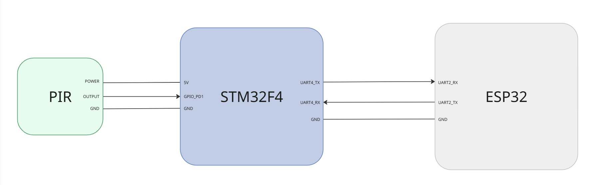

# IoT Desk Occupancy Tracker

Tracks desk sitting sessions and publishes duration data to AWS IoT Core over MQTT/TLS. Includes an A/B bootloader for OTA firmware updates.

## Repository structure

* `app/` contains the PIR sitting session tracker. Publishes session data to AWS IoT Core over MQTT/TLS via an ESP32 Wi-Fi bridge running FreeRTOS. See `app/README.md` for setup and configuration.

* `bootloader/` contains the A/B bootloader. Reads a boot descriptor from flash, selects the active firmware slot, and jumps to it. See `bootloader/README.md` for the flash layout and boot flow.
